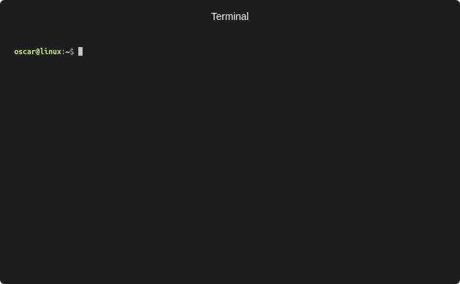

<h1 align="center">Netlify Dynamic DNS</h1>
<p align="center">
    </img>
</p>
<p align="center">
    A simple command line tool for updating a <a href="https://www.netlify.com/docs/dns/">Netlify's Managed DNS</a> record to point at your public IP address. Supporting both IPv4 and IPv6.
    <br />
    <br />
    <a href="https://goreportcard.com/report/github.com/oscartbeaumont/netlify-dynamic-dns"></img></a>
    <a href="https://paypal.me/oscartbeaumont" style="padding-left: 10px;"></img></a>
</p>

## Installation & Usage

```bash
# Install via script
curl -s -L https://raw.githubusercontent.com/oscartbeaumont/netlify-dynamic-dns/master/install.sh | sudo sh

# Set home.example.com to your public IP and quit
nddns -accesstoken xxx -zone example.com -record home

# Set home.example.com to your pulbic IP every 5 minutes
nddns -accesstoken xxx -zone example.com -record home -interval 5

# Using Docker
docker run ghcr.io/oscartbeaumont/netlify-dynamic-dns:latest -accesstoken xxx -zone example.com -record home -interval 5

# From Git
git clone https://github.com/oscartbeaumont/netlify-dynamic-dns.git
cd netlify-dynamic-dns
go run ./cmd -accesstoken xxx -zone example.com -record home
```

## Configuration

| Flag         | Environment Variable | Default     | Description                                                                                                |
|--------------|----------------------|-------------|------------------------------------------------------------------------------------------------------------|
| access-token | NDDNS_ACCESS_TOKEN   |             | Your Netlify personal access token. Can be created at [here](https://app.netlify.com/account/applications) |
| zone         | NDDNS_ZONE           | example.com | The Netlify DNS zone domain name                                                                           |
| record       | NDDNS_RECORD         | home        | The record in the DNS zone to set as your public IP                                                        |
| ipv6         | NDDNS_IPv6_ENABLED   | true        | Whether the IPv6 record (AAAA) should also be updated                                                      |
| interval     | NDDNS_INTERVAL       | 0           | The amount of minutes between sending updates. If 0 only a single update is done.                          |

If you would like a custom TTL value, create an existing record (you can set anything in the IP field) and then the application will use it when recreating the record.

## Analytics

This application has analytics built in which is used to help the developers make a better product. Simple Analytics was chosen due to their strong views on protecting the privacy of users. They are also GDPR, CCPA, & PECR compliant. The data collected can be viewed by anyone by clicking the badge below.

<a href="https://simpleanalytics.com/nddns.app.otbeaumont.me?utm_source=nddns.app.otbeaumont.me&utm_content=badge" referrerpolicy="origin" target="_blank"></a>

## How It Works

Netlify Dynamic DNS uses the [OpenDNS](https://www.opendns.com) resolver to determine your public IP. The resolver has a feature which echoes the clients IP address when you lookup `myip.opendns.com`. This lookup is done both over IPv4 and IPv6 to determine both public IP's then using the [Netlify OpenAPI Client](https://github.com/netlify/open-api) the old DNS records are removed and new ones are created with your latest public IP.
